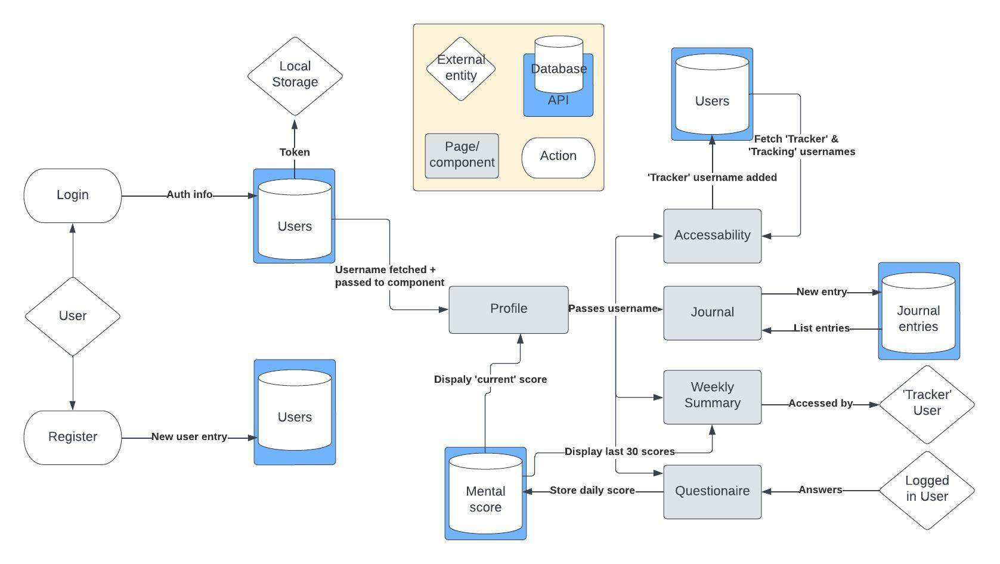
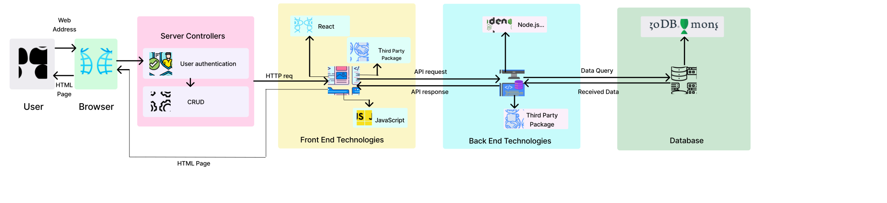

# SERENE - Documentation 

[Live site](https://mernclient-production.up.railway.app/track)

[Client github](https://github.com/seanlb02/MERN_client)

## Operating the site 

Feel free to create an account and navigate at will. However, to have a quick look at full Serene, use the following test account at sign in:

Username: <em>testaccount</em>

Password: <em>password</em>

### <u>Profile/Journal page</u>

This landing page shows you (1) a daily memo/affirmation/inspiration that can be updated at will and (2) a list of journal entries organised from earliest to latest. 

Feel free to add your own entry whenever inspiration strikes

### <u>Check in (questionnaire)</u>

A simple 10 question mental wellbeing profiler returns a score out of 50. With increasing scores representing higher states of distress. These scores are logged in a 30 day summary chart on your <em>summary</em> page.

### <u>Summary page</u>

This page summaries your emotions over the past 24 hours (pie chart), as well as your wellbeing scores recorded over the past 30 days (line chart)

### <u>Authorise Tracker page</u>

This page lists (1) the users who you have authorised to track your summary page and (2) the users who have authorised YOU to track THEIR summary page. 

Enter a username of a user you wish to authorise. Click the 'X' to revoke this access. 

Click on a green username tag to view a summary of one of the users you are tracking. 

### <u>Settings</u> 

A page for you to delete your account if needed. Account deletion with remove all user data from the database including all authorisations given to trackers. 

# Site Description

### Purpose 

Serene is a mental health journaling platform that gives users – and other users they authorise – the ability to log and track changes in their emotional state through time.

Serene was built to solve the problem people face in (1) recounting discrete changes in their mental health and (2) disclosing these changes to the people around them.

It does this by allowing users to log their mental state each day via journal entries and a regular 'check-in' (wellbeing questionnaire), with select data summarised by a weekly/daily graphical snapshot. 

Unfortunately, many people struggle to disclose their mental state to others. With Serene, users can grant access to their mental wellbeing data to other users (e.g. psychologists, social workers, family members) for the purposes of monitoring.

Monitoring mental health chages with SERENE will help users better understand their moods so that they can be managed. 

The app intends to play a role in reducing the stigma in  communities where mental illness isn’t widely talked about. A recent study showed approximately 20% of Australians were reportedly living with a mental disorder in 2021 (ABS,2022), which illustrates the need for easily accessible mental health resources. 

### Functionality/features 

- Users ar able to add short journal entries with accompanying ‘emotion’ tags to their profile
- Users are able to answer a mental wellbeing questionnaire intended as a mental health 'check-in'
- Users are able to view a daily and monthly summary of their mental wellbeing, as recorded with journal entry tags and questionnaire results. 
- Users may grant access to their summary to other select users for the purposes of remote monitoring.

### Target Audience 

Although all demographics are welcomed to user Serene, it is initially targeted at therapists/social workers by providing a tool to remotely track the mental health of the people under their duty of care. 
  
## Tech Stack 

### <u>Front end</u>

React, Bootstrap

### <u>Back end</u>

Express/Node js, MongoDb, Mongoose 

### <u>Testing</u>

Vitest, Jest

### <u>Deployment</u>

Railway 

### <u>Client-side Modules</u>

popperJS, dotenv, JWT-decode

## Data Flow Diagram

## Application Architecture Diagram

## User stories 

Home 
- User must be able to register and sign in to their profile 
- User should be given a summary of what the app does 

Profile 
- User should have constant access to navigation via a navbar
- User should be able to see their username, welcome message and inspirational quote

Journal [profile component child]
- User should be able to post a journal entry with text, an ‘emotion’ tag and timestamp at any time
- User should be able to see a list of previous journal entries
- User should be able to delete posts

Weekly summary [profile component child]
- User should be able to see a summary of the past 30 days, that for each day shows (1) date (2) questionnaire score/colour (3) tags posted 

Questionnaire [profile component child]
- Each week a user should have the opportunity to answer a mental wellbeing questionnaire that gives them a score out of 10-50  
- User should have this score stored with a timestamp in the db
- User should be blocked for completing the questionnaire more than one time per week

Grant Access [profile component child]
- User should be able to see a list of usernames that have given them access to view their calendar (trackers) 
- Users should be able to search and add usernames to a list of people who can view THEIR summary (populate ‘tracking’ field in db collection)

Settings 
- User must be able to delete their account

## Screenshots

### <u>Profile/Jorunal</u>

### <u>Check-in<u>

### <u>Summary</u>

### <u>User tracking</u>

# Planning 

## Wireframes 

High-resolution wireframes located in /assets/Wireframes.

### <u>Sign up</u>

### <u>Log in</u>

### <u>Profile</u>

### <u>Journal</u>

### <u>Questionnaire</u>

### <u>Summary</u>
 

### <u>Settings</u>

### <u>Authorise remote tracker</u>

## Trello Screenshots 
(https://trello.com/b/MMurIsLO/mern-frontend-kanban)  

## References 

ABS. 2022. National Study of Mental Health and Wellbeing. https://www.abs.gov.au/statistics/health/mental-health/national-study-mental-health-and-wellbeing/latest-release. Accessed 20/1/2023